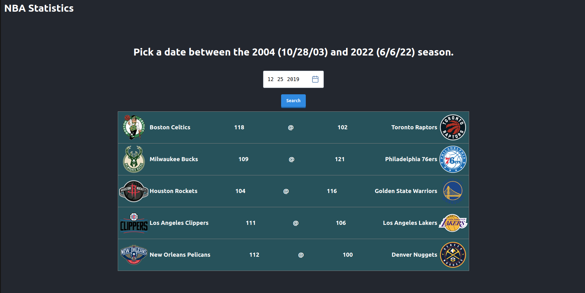
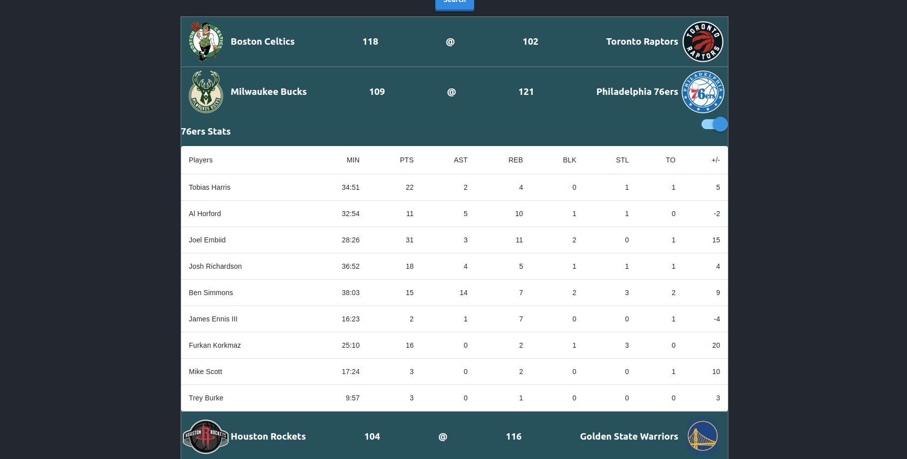

# NBA Statistics App

This project is a React.js-based web application that provides detailed NBA game statistics on specific dates. It leverages a responsive and user-friendly frontend to enhance the user experience.

## App Functionality

The NBA Statistics App allows users to:

- Pick a date between 10/29/03 and 6/6/22.
- Check if there are any NBA games on the selected date.
- View matchups and end scores for games on the chosen date.
- Click on a matchup to see detailed statistics for each team.
- Toggle between teams to compare their stats.

